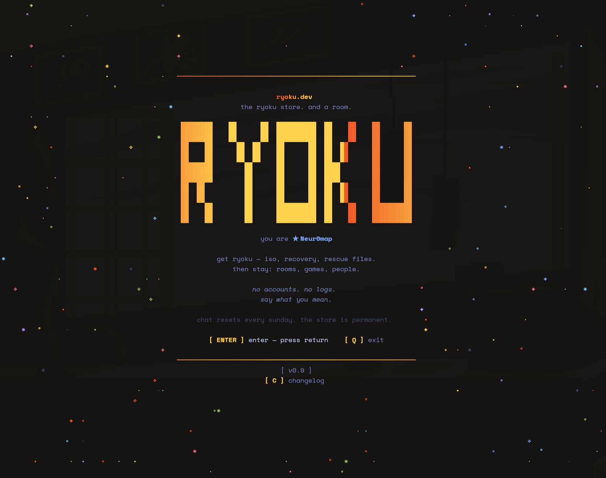

<div align="center">

# ryolink

**The Ryoku store. And a room.**

Grab the ISO, the recovery script, the rescue files — straight from your
terminal, or a browser. Then stay a while: it's also a chatroom over SSH
where your key is your identity.

```
ssh ryoku.dev
```



</div>

---

## No accounts. No logs. No signup

Your SSH key is who you are. There is nothing to register, no email to
give, no password to reuse. Everyone's chat resets every Sunday — the
store is the only permanent thing.

## What's inside

**The store** — ryolink's front page. Browse the Ryoku catalog (the live
image, the panic-button recovery script, rescue files), and take whatever
you need: each card carries the `curl` line for your terminal and the
plain URL for your browser. Downloads resume, and every artifact shows
its sha256 so you can verify what landed. The same catalog serves the web
landing page and `/api/items` as JSON.

**Rooms** — the lounge (where Mika keeps the bar), a gallery of shared
sticky notes you can drag around, co-op sudoku, suggestions, and
OverTheWire wargame rooms with flag submission and a leaderboard.

**Everything is reachable two ways.** `ctrl+p` opens the command palette
— type a few letters, hit enter. The F-keys do the same things directly.
Clicks work too: cursor mode (`ctrl+m`) lets the mouse drive rooms,
items, and the gallery.

```
F1  help          F2  nickname      F3  rooms         F4  mentions
F5  post note     F6  tankard       F7  leaderboard
S   store         ⌃P  commands      ⌃M  cursor mode   `   copy link
```

## Run your own

The whole product is **one static binary** — the SSH server, the
storefront, the admin CLI, and all default content (radio catalogue,
bar-keeper persona, mystery case, store landing page) are embedded. No
web server required; Caddy is an optional TLS front.

```bash
make ryolink        # build (CGO off, static)
./ryolink init      # writes ~/.config/ryolink/ryolink.yaml + the database
./ryolink up        # run it — then: ssh localhost -p 2222
```

`ryolink.yaml` is the entire control surface: identity, store catalog,
rooms, ports, wargame flags, feed subreddits, purge schedule, and the
security block. Stock the shelves by pointing `store.items` at files in
the data dir (they stream with sha256 + resume) or at your mirror URLs.
Change the feed or the CTF board by editing the file and
`ryolink service reload` — no restart, no dropped sessions.

Put it in production as a service (root, once):

```bash
sudo ./ryolink service install    # hardened systemd unit, generated from your YAML
```

That unit is deliberately paranoid: its own user, one capability
(`CAP_NET_BIND_SERVICE`, so it can take port 22), the filesystem sealed
read-only except its data dir. ryolink accepts any SSH key by design, so
it also ships an in-process firewall — per-IP budgets, auth-fail bans,
scanner-probe bans, a persistent deny list — and refuses exec, sftp,
scp, and port forwarding at the protocol layer. The details, in plain
language, are in [SECURITY.md](SECURITY.md); please read it before you
expose a room.

Admin commands (`--message`, `--ban`, `--deny`, `--add-room`, `purge`, …)
take effect without a restart; see `ryolink --help`.

**Docker:** `docker compose up` (mount your `ryolink.yaml` at `/data`).

**Environment variables** (all optional; they override the `api:` block):

| Variable | What it does |
|---|---|
| `OPENAI_API_KEY` | Mika / bartender character |
| `KLIPY_API_KEY` | GIF search (`/gif`) |
| `EXA_API_KEY` | Web search for the bar-keeper |
| `REDDIT_CLIENT_ID` / `REDDIT_CLIENT_SECRET` | Reddit feed OAuth |
| `RYOLINK_CONFIG` | Path to ryolink.yaml |
| `RYOLINK_PORT` | Overrides `server.port` |

The full production runbook — systemd, port-22 takeover, UFW, optional
Caddy — is [deploy/SETUP.md](deploy/SETUP.md). Hacking on it?
[DEVELOPMENT.md](DEVELOPMENT.md) collects the parts that will bite you.

## Forking

The engine is yours under GPL-3.0 (see [LICENSE](LICENSE)) — fork it,
ship it, sell it, just share the source. The names **ryolink** and
**ryoku.dev** are not part of the deal: see [TRADEMARK.md](TRADEMARK.md).
The config enforces this by design; your instance runs under your own
name and domain.

## Built with

[Bubble Tea](https://github.com/charmbracelet/bubbletea) ·
[Wish](https://github.com/charmbracelet/wish) ·
[Lipgloss](https://github.com/charmbracelet/lipgloss) · Go · SQLite

## Releases

Every merge to `main` cuts a version, publishes a GitHub release with
the binary attached, and the notes come from the same [CHANGELOG.md](CHANGELOG.md)
the in-app changelog (`C` on the splash) reads. No surprises about which
"latest" you're looking at.
